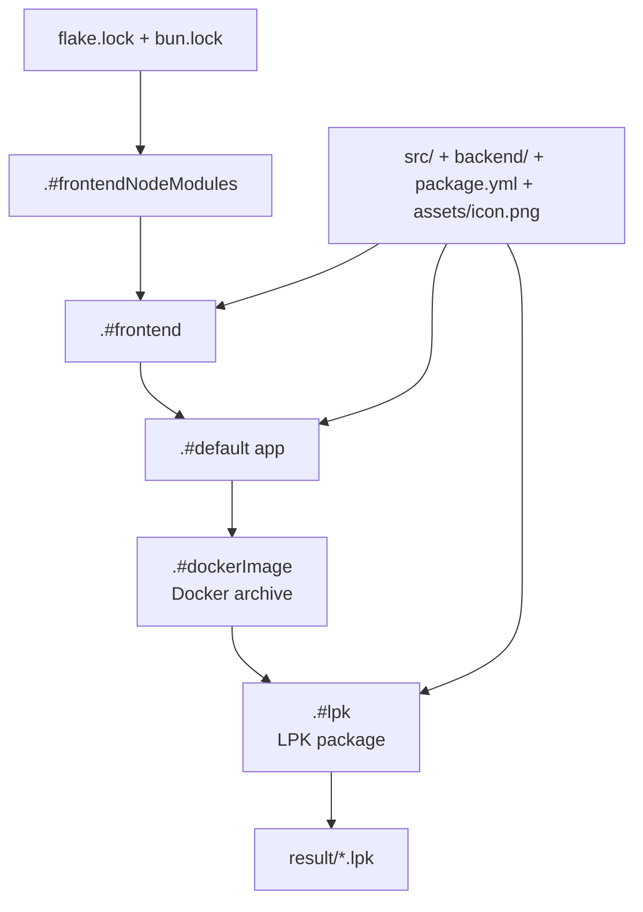
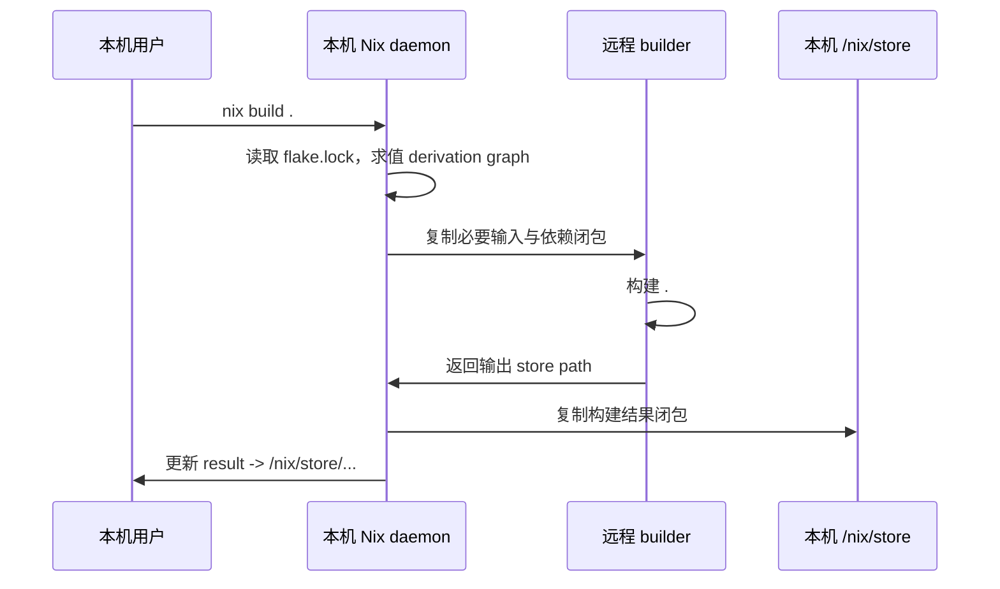
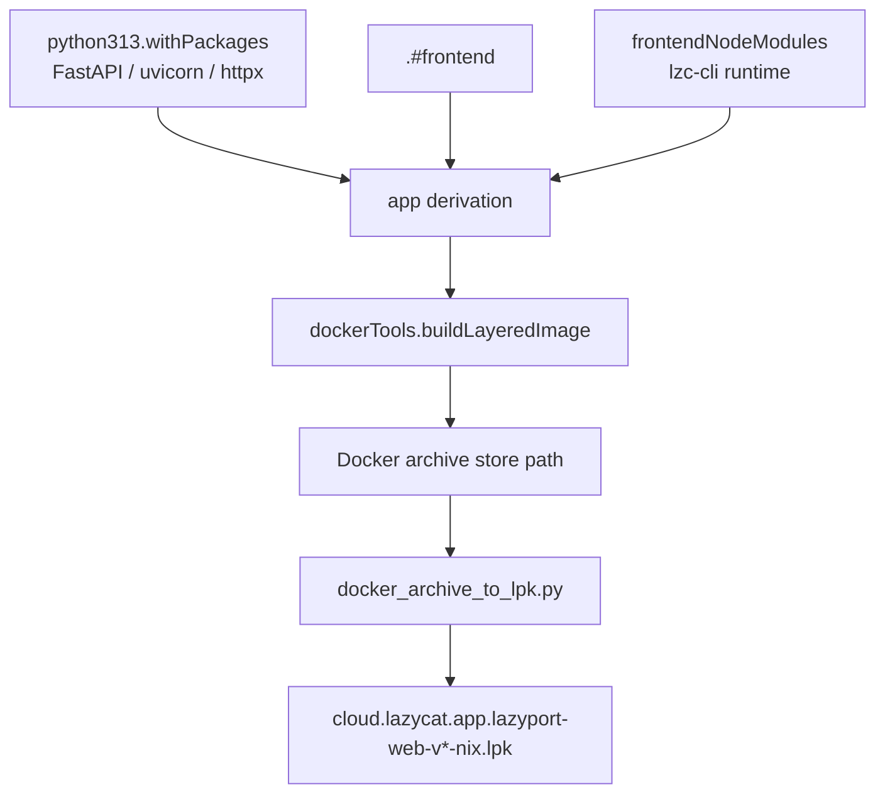
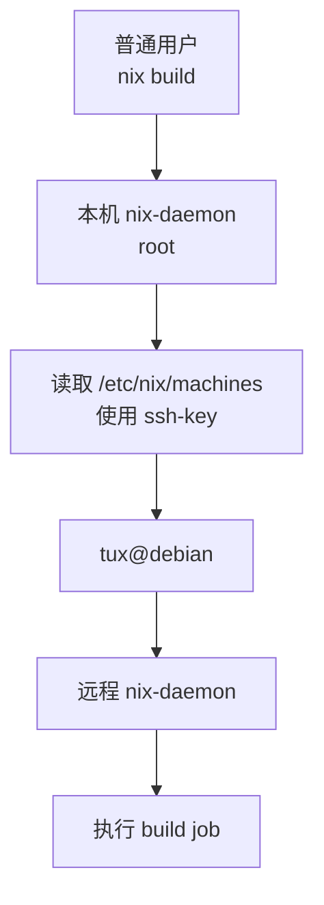
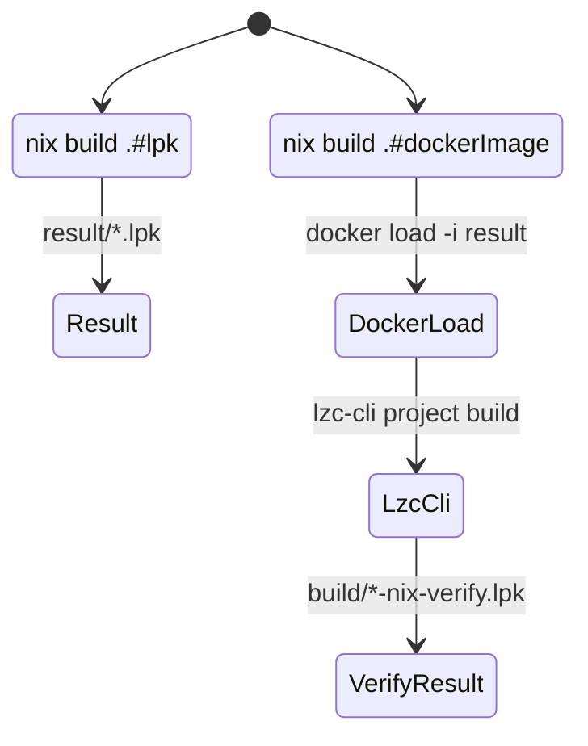
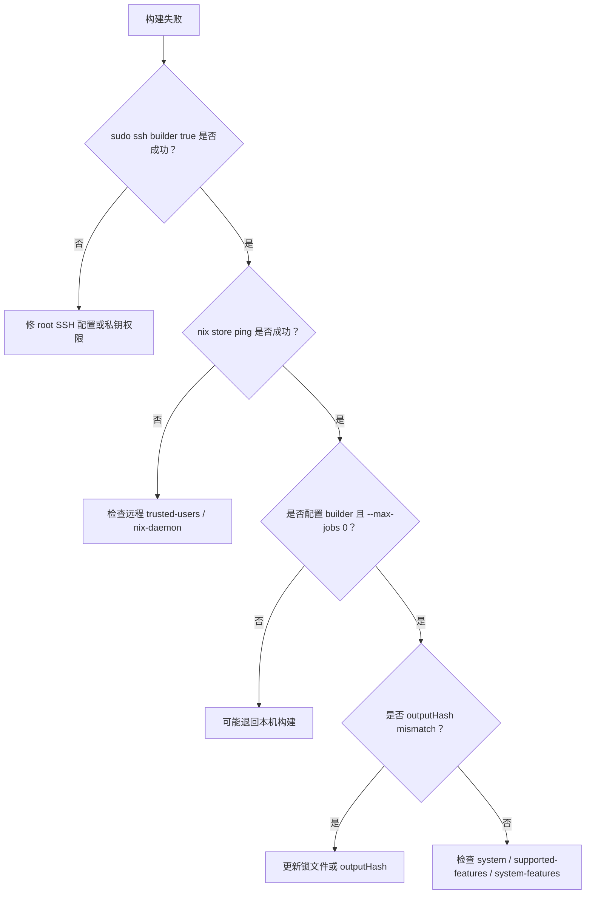

# Nix 远程构建：把构建链路从本机迁移到 Builder

本机开发环境通常不适合作为长期可信的构建环境。前端项目会留下 `node_modules`，Python 项目会混用多个虚拟环境，Docker daemon 里也会堆积历史镜像和 buildx 状态。构建命令能在本机跑通，并不代表构建规则是完整的；它可能只是依赖了本机上某个刚好存在的全局工具、缓存目录或环境变量。

Nix 远程构建要解决的问题不是“把命令放到另一台机器上执行”，而是把构建拆成可描述、可调度、可复制的 store path。本文以 `lazyport-web` 的构建方案为例，说明如何把前端、后端、Docker image 和 LPK 打包都收敛到 `flake.nix`，再通过 Nix distributed builds 派发到远程 builder。

## 构建链路总览

`lazyport-web` 的可复现构建入口是 `nix build .#lpk`。这个目标不是直接跑 Dockerfile，而是先由 Nix 构建前端、组合应用目录、生成 Docker archive，最后把 archive 转成 LPK 包。



这条链路的关键点是每一层都变成了 Nix derivation。只要输入不变，输出 store path 就稳定；如果依赖、源码或构建脚本变化，Nix 会生成新的 store path，而不是复用工作区里的历史产物。

## 为什么使用 distributed builds

Nix 有两类常见远程构建方式：

| 模式 | 命令形态 | 适合场景 |
| --- | --- | --- |
| 远程 store 构建 | `nix build --store ssh-ng://builder` | 直接把当前命令连接到某个远程 store |
| distributed builds | `nix build --builders ... --max-jobs 0` | 本机求值，由 Nix daemon 调度 build job 到 builder |

`lazyport-web` 使用第二种，也就是 Nix/Lix 官方的 distributed builds。原因是它更接近长期工程化使用方式：本机仍然执行求值、管理 `result` 链接和接收最终输出；真正耗时的 build job 由 Nix daemon 按 `/etc/nix/machines` 或 `--builders` 配置派发到远程机器。



`--max-jobs 0` 是这里的核心开关。它表示本机不执行 build job；如果没有可用 builder，构建会失败，而不是悄悄退回本机构建。这对验证远程构建配置很有用。

## flake 分层设计

远程构建是否稳定，主要取决于 `flake.nix` 是否把隐式依赖显式化。`lazyport-web` 的 flake 大致分为五层：


### frontendNodeModules

前端依赖单独构建成 fixed-output derivation：

```nix
frontendNodeModules = pkgs.stdenvNoCC.mkDerivation {
  pname = "lazyport-web-node_modules";
  src = ./.;

  nativeBuildInputs = [
    pkgs.bun
    pkgs.writableTmpDirAsHomeHook
  ];

  buildPhase = ''
    export BUN_INSTALL_CACHE_DIR=$(mktemp -d)
    bun install --frozen-lockfile --ignore-scripts --no-progress
  '';

  installPhase = ''
    mkdir -p $out
    cp -R node_modules $out/node_modules
  '';

  outputHash = "sha256-...";
  outputHashAlgo = "sha256";
  outputHashMode = "recursive";
};
```

这一层的作用是切断工作区 `node_modules` 对构建的影响。`bun.lock` 决定依赖内容，`outputHash` 固定下载结果；如果依赖发生变化，Nix 会报 hash mismatch，而不是继续使用旧依赖。

### frontend

真正的前端构建不执行 `bun install`，而是从上一层复制固定好的 `node_modules`：

```nix
configurePhase = ''
  cp -R ${frontendNodeModules}/node_modules ./node_modules
  patchShebangs node_modules
'';

buildPhase = ''
  export LAZYPORT_VERSION=${buildVersion}
  bun run build
'';

installPhase = ''
  mkdir -p $out
  cp -R dist/. $out/
'';
```

`patchShebangs` 用来修正依赖包脚本中的解释器路径。Nix 构建环境里不能假设 `/usr/bin/env node` 总是可用，把 shebang 修到 store 内的解释器更可靠。

### app / dockerImage / lpk

后端使用 `python313.withPackages` 固定运行时依赖，前端产物复制到应用目录，最后由 `dockerTools.buildLayeredImage` 生成 Docker archive。`.#lpk` 再调用脚本把 Docker archive 转成 LPK 内部需要的 OCI layout。



这条路径不依赖本地 Docker daemon，也不依赖 `lzc-cli project build`。Docker image 是 Nix 产物，LPK 也是 Nix 产物。

## 远程 builder 配置

distributed builds 的机器列表可以写在 `/etc/nix/machines`。一个最小配置如下：

```text
ssh://tux@debian x86_64-linux /home/tux/.ssh/id_ed25519 4 1 big-parallel
```

字段含义如下：

| 字段 | 示例 | 说明 |
| --- | --- | --- |
| `store-uri` | `ssh://tux@debian` | 远程 Nix store 地址 |
| `system` | `x86_64-linux` | 远程机器架构 |
| `ssh-key` | `/home/tux/.ssh/id_ed25519` | 本机 root 可读的 SSH 私钥 |
| `max-jobs` | `4` | 同时派发到该 builder 的 job 数 |
| `speed-factor` | `1` | 调度权重 |
| `supported-features` | `big-parallel` | 远程机器支持的系统特性 |
| `mandatory-features` | 空 | 必须匹配的特性 |

本机 `/etc/nix/nix.conf` 启用机器列表：

```conf
builders = @/etc/nix/machines
builders-use-substitutes = true
experimental-features = nix-command flakes
```

远程机器需要允许 SSH 登录用户执行受信任构建：

```conf
trusted-users = root tux
system-features = big-parallel
experimental-features = nix-command flakes
```

配置完成后重启两边 daemon：

```bash
sudo systemctl restart nix-daemon
```

## SSH 连接路径

多用户 Nix/Lix 下，发起远程构建连接的通常是本机 Nix daemon，也就是 root。这里最容易出错的是普通用户可以 `ssh debian`，但 root 不能。



建议分别测试：

```bash
sudo ssh debian true
nix store ping --store ssh://tux@debian
```

如果普通用户能连、`sudo ssh` 不能连，就给 root 配置 SSH host，或者在 `/etc/nix/machines` 中写完整的 `ssh://user@host` 和私钥路径。

## 构建脚本

`lazyport-web` 的脚本把远程构建入口固定成 `.#lpk`：

```bash
#!/usr/bin/env bash
set -Eeuo pipefail

REMOTE_BUILDER="${REMOTE_BUILDER:-}"
PACKAGE="${PACKAGE:-.#lpk}"
OUT_LINK="${OUT_LINK:-result}"
MAX_JOBS="${MAX_JOBS:-0}"

REMOTE_ARGS=()
if [[ -n "$REMOTE_BUILDER" ]]; then
  REMOTE_ARGS+=(--builders "$REMOTE_BUILDER")
fi

nix build "$PACKAGE" \
  "${REMOTE_ARGS[@]}" \
  --max-jobs "$MAX_JOBS" \
  --out-link "$OUT_LINK"
```

日常使用：

```bash
nix develop -c scripts/remote-nix-build-lpk.sh
```

构建其它目标：

```bash
nix develop -c env PACKAGE=.#dockerImage scripts/remote-nix-build-lpk.sh
```

临时覆盖 builder：

```bash
nix develop -c env REMOTE_BUILDER='ssh://tux@debian x86_64-linux /home/tux/.ssh/id_ed25519 4 1 big-parallel' scripts/remote-nix-build-lpk.sh
```

## 与传统 Dockerfile 构建的边界

`lazyport-web` 仍然保留 `lzc-cli` 校验路径，用来验证懒猫官方打包链路能够消费 Nix 产出的镜像。但这条路径属于兼容校验，不是主要的可复现构建入口。



两条路径的差异：

| 路径 | 是否需要 Docker daemon | 是否需要 lzc-cli | 主要用途 |
| --- | --- | --- | --- |
| `nix build .#lpk` | 不需要 | 不需要 | 可复现产物 |
| `scripts/verify-nix-lzc-build.sh` | 需要 | 需要 | 验证传统打包链路 |

远程构建优先派发 `.#lpk`，因为它的依赖都在 Nix graph 内；如果远程构建目标需要访问本机 Docker daemon，就失去了分布式构建的意义。

## 常见故障定位



### `experimental Nix feature 'flakes' is disabled`

本机和远程都需要开启：

```conf
experimental-features = nix-command flakes
```

### root 无法 SSH

多用户 Nix 下不要只测试普通用户 SSH。应测试：

```bash
sudo ssh debian true
```

如果失败，检查 `/root/.ssh/config`、私钥路径、私钥权限，以及 `/etc/nix/machines` 中的 host 是否能被 root 解析。

### builder 不接 job

检查 `/etc/nix/machines` 的第 6 列 `supported-features`。如果 derivation 需要某个 feature，而 builder 没声明，Nix 不会把 job 派给它。反过来，也不要声明远程机器并不具备的 feature。

### `outputHash` 不匹配

fixed-output derivation 的 hash mismatch 通常说明依赖输出变了。对 `frontendNodeModules` 来说，常见原因是 `bun.lock` 变化、包管理器版本变化，或者上游包内容变化。确认变化合理后，把 Nix 报错中的实际 hash 更新到 `flake.nix`。

### 架构不匹配

`flake.nix` 中应明确支持的系统：

```nix
systems = [ "x86_64-linux" "aarch64-linux" ];
```

远程机器的 `system` 必须和构建目标匹配。`x86_64-linux` builder 不能直接执行 `aarch64-linux` 原生构建，除非你额外配置交叉编译或模拟执行环境。

## 结论

Nix 远程构建的重点不是省掉一条 SSH 命令，而是把构建从“本机状态”迁移到“声明式构建图”。

```mermaid
flowchart LR
  local["本机环境\nPATH / node_modules / Docker cache"] -.不可信.-> old["手工构建"]
  flake["flake.nix\n显式依赖"] --> graph["derivation graph"]
  graph --> builder["远程 builder"]
  builder --> store["/nix/store 输出闭包"]
  store --> result["result 链接"]
```

当 `flake.nix` 把依赖、构建步骤和输出边界都描述清楚后，远程 builder 只需要提供算力和 Nix daemon。构建结果通过 store path 回到本机，`result` 指向的是一份可追踪的 Nix 产物，而不是某个目录里偶然生成的文件。
